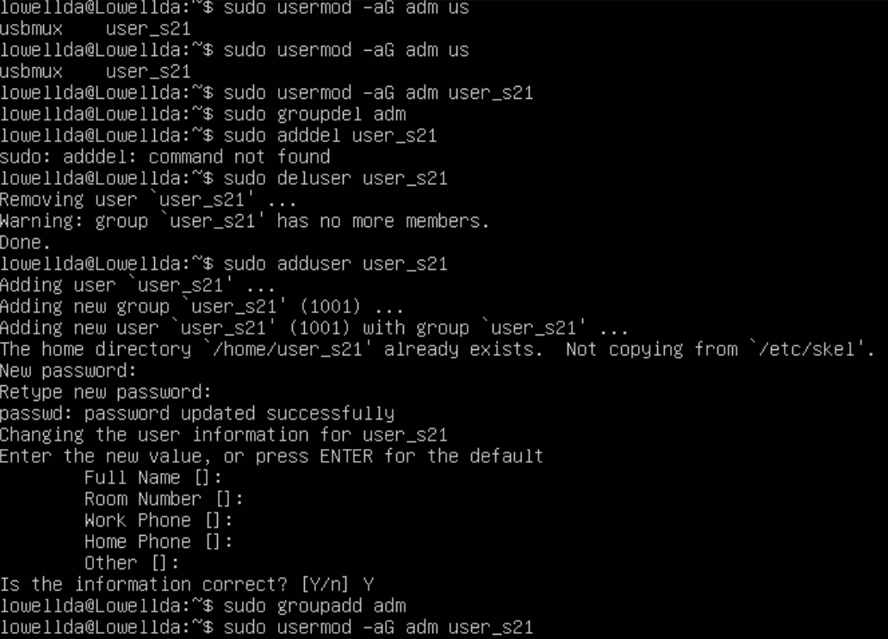
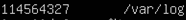
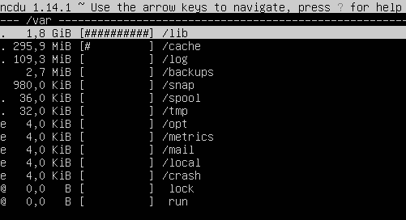

# Отчёт

## Part 1. Установка ОС Ubuntu 20.04 Server LTS.
Узнаём версию Ubuntu, выполнив команду cat etc/issue.


## Part 2. Создание пользователя.
### 2.1. Создаём пользователя, отличного от пользователя, который, создавался при установке.
Новый пользователь должен быть в выводе команды cat etc/passwd.

СОЗДАНИЕ ПОЛЬЗОВАТЕЛЯ В LINUX
Вся информация о пользователях находится в файле /etc/passwd. Мы могли бы создать пользователя linux просто добавив его туда, но так делать не следует, поскольку для этой задачи существуют специальные утилиты. Одна из таких утилит, это useradd. Рассмотрим ее подробнее.

КОМАНДА USERADD
Это довольно простая команда, которая есть во всех дистрибутивах Linux. Она позволяет зарегистрировать нового пользователя или изменить информацию об уже имеющемся. Во время создания можно даже создать домашний каталог пользователя и скопировать в него системные файлы. Рассмотрим синтаксис команды:

```
$ useradd опции имя_пользователя
```
Все довольно просто, дальше нам нужно рассмотреть основные опции команды, с помощью которых вы будете настраивать нового пользователя:
* -b - базовый каталог для размещения домашнего каталога пользователя, по умолчанию /home;
* -c - комментарий к учетной записи;
* -d - домашний каталог, в котором будут размещаться файлы пользователя;
* -e - дата, когда учетная запись пользователя будет заблокирована, в формате ГГГГ-ММ-ДД;
* -f - заблокировать учетную запись сразу после создания;
* -g - основная группа пользователя;
* -G - список дополнительных групп;
* -k - каталог с шаблонами конфигурационных файлов;
* -l - не сохранять информацию о входах пользователя в lastlog и faillog;
* -m - создавать домашний каталог пользователя, если он не существует;
* -M - не создавать домашнюю папку;
* -N - не создавать группу с именем пользователя;
* -o - разрешить создание пользователя linux с неуникальным идентификатором UID;
* -p - задать пароль пользователя;
* -r - создать системного пользователя, не имеет оболочки входа, без домашней директории и с идентификатором до SYS_UID_MAX;
* -s - командная оболочка для пользователя;
* -u - идентификатор для пользователя;
* -D - отобразить параметры, которые используются по умолчанию для создания пользователя. Если вместе с этой опцией задать еще какой-либо параметр, то его значение по умолчанию будет переопределено.



### 2.2. Вывод команды cat etc/passwd.


## Part 3. Настройка сети ОС.
### 3.1. Задать название машины вида user-1.
Hostname (имя компьютера, имя хоста) задается во время установки системы Linux. Hostname определяет название компьютера и используется преимущественно для идентификации компьютера в сети. Нельзя назначать два одинаковых Hostname для компьютеров в одной сети.

Воспользуемся командой hostnamectl, чтобы установить новое значение Hostname равным user-1. Используется аргумент set-hostname:

```
$ sudo hostnamectl set-hostname user-1
```

После перезагрузки ОС видим изменённое имя машины.


### 3.2. Установить временную зону, соответствующую вашему текущему местоположению.


### 3.3. Вывести названия сетевых интерфейсов с помощью консольной команды ip.

```
$ ip [опции] объект команда [параметры]
```

Опции - это глобальные настройки, которые сказываются на работе всей утилиты независимо от других аргументов, их указывать необязательно.

Объект - это тип данных, с которым надо будет работать, например: адреса, устройства, таблица arp, таблица маршрутизации и так далее.

Команды - какое-либо действие с объектом.

Параметры - само собой, командам иногда нужно передавать параметры, они передаются в этом пункте.

Рассмотрим опции более подробно:

* -v, -Version - только вывод информации об утилите и ее версии.
* -h, -human - выводить данные в удобном для человека виде.
* -s, -stats - включает вывод статистической информации.
* -d, -details - показывать ещё больше подробностей.
* -f, -family - позволяет указать протокол, с которым нужно работать, если протокол не указан, то берется на основе параметров команды. Опция должна принимать одно из значений: bridge, dnet, inet, inet6, ipx или link. По умолчанию используется inet, link - означает отсутствие протокола.
* -o, -oneline - выводить каждую запись с новой строки.
* -r,-resolve - определять имена хостов с помощью DNS.
* -a, -all - применить команду ко всем объектам.
* -c, -color - позволяет настроить цветной, доступные значения: auto, always и never.
* -br, -brief - выводить только базовую информацию для удобства чтения.
* -4 - короткая запись для -f inet.
* -6 - короткая запись для -f inet-f inet6.
* -B - короткая запись для -f inet-f bridge.
* -0 - короткая запись для -f inet -f link.

Теперь рассмотрим самые важные объекты.

address или a - сетевые адреса.
link или l - физическое сетевое устройство.
neighbour или neigh - просмотр и управление ARP.
route или r - управление маршрутизацией.
rule или ru - правила маршрутизации.
tunnel или t - настройка туннелирования.

Теперь рассмотрим доступные команды, с помощью которых может быть выполнена настройка сети linux. Они зависят от объекта, к которому будут применяться. Вот основные команды: add, change, del или delete, flush, get, list или show, monitor, replace, restore, save, set, и update. Если команда не задана, по умолчанию используется show (показать).

Чтобы посмотреть все IP адреса, связанные с сетевыми интерфейсами используем команду:

```
$ ip a
```


В данном консольном выводе мы видим наличие интерфейса lo - localhost.

___localhost (так называемый, «местный» от англ. local, или «локальный хост», по смыслу — этот компьютер)___ — в компьютерных сетях, стандартное, официально зарезервированное доменное имя для частных IP-адресов (в диапазоне 127.0.0.1 — 127.255.255.254, RFC 2606). Для сети, состоящей только из одного компьютера, как правило, используется всего один адрес — 127.0.0.1, который устанавливается на специальный сетевой интерфейс «внутренней петли» (англ. loopback) в сетевом протоколе TCP/IP. В Unix-подобных системах данный интерфейс обычно именуется «loN», где N — число, либо просто «lo». __Loopback__ — это термин, который обычно используется для описания методов или процедур маршрутизации электронных сигналов, цифровых потоков данных, или других движущихся сущностей от их источника и обратно к тому же источнику без специальной обработки или модификаций. Первоначально он использовался для тестирования передачи или передающей инфраструктуры. При установке соединений в этой вырожденной «сети» присутствует только один компьютер, при этом сетевые протоколы выполняют функции протоколов межпроцессного взаимодействия.

Использование адреса 127.0.0.1 позволяет устанавливать соединение и передавать информацию для программ-серверов, работающих на том же компьютере, что и программа-клиент, независимо от конфигурации аппаратных сетевых средств компьютера (не требуется сетевая карта, модем, и прочее коммуникационное оборудование, интерфейс реализуется при помощи драйвера псевдоустройства в ядре операционной системы). Таким образом, для работы клиент-серверных приложений на одном компьютере не требуется изобретать дополнительные протоколы и дописывать программные модули. Примером может быть запущенный на компьютере веб-сервер и обращение к нему с этого компьютера для веб-разработки на этом компьютере без необходимости выкладывать веб-программу в сеть интернет, пока её разработка не закончена.

Традиционно адресу 127.0.0.1 однозначно сопоставляется имя хоста «.localhost» и/или «localhost.localdomain», то есть, по умолчанию, присутствует перенаправление на себя. Есть также рекомендации к использованию специальных доменных имен, таких как .test, .example и .invalid.(RFC 2606), но они еще не вошли в практику и традиционно еще по умолчанию не настроены.

В IPv6 локальному хосту сопоставляется IP-адрес ::1/128 (0:0:0:0:0:0:0:1).

### 3.4. Используя консольную команду получить ip адрес устройства от DHCP сервера.

IP адрес — это числовой адрес хоста расположенного в сети, и служит для его поиска и обращения к нему. Динамически назначаемый адрес может меняться от сессии к сессии в то время, как статический не изменяется и после перезагрузки устройства.

Динамический адрес назначается протоколом динамической конфигурации хоста — DHCP, такой тип адреса чаще всего по умолчанию провайдеры выдают хостам клиентов.

Статический же адрес жестко привязывается к машине или указывается на ней вручную. Такой адрес необходим, например серверам в интернете для того, чтобы иметь возможность привязывать к ним доменные имена и пользователи сети всегда имели бы удобный инструмент обращения к конкретному узлу.

Для того чтобы точно определить, является ли IP статическим или динамическим средствами ОС явного способа не существует. Потому как практически у каждого пользователя будет указано DHCP, ведь практически все компьютеры сейчас подключены через роутер который динамически раздает клиентам адреса. Самый верный способ узнать какой у тебя тип IP — это мониторить свой внешний адрес каждый раз при перезагрузке устройства — если он изменяется — то он динамический.

Но бывает так, что возникает необходимость проверить, нет ли на узле жестко прописанного IP адреса, именно такую задачу мы сейчас и решим.

Узнаем тип адреса у интерфейса.
Для этого используем команду ip в терминале:

```
$ ip r
```

На скриншоте ниже видно, что IP интерфейсу присвоен динамически, т.к. в выводе присутствует аббр. DHCP.


Соответственно если в выводе данная аббр. отсутствует — это будет означать, что IP статический.

Данный метод проверки подойдет особенно тогда, когда подключение к компьютеру производится удаленно, т.к. действие осуществляется из командной строки.

___Dynamic Host Configuration Protocol (DHCP)___ — автоматически предоставляет IP адреса и прочие настройки сети (маску сети, шлюз и т.п) компьютерам и различным устройствам в сети.

Клиент настроенный на получение адреса по протоколу DHCP посылает запрос к серверу, и тот в свою очередь предоставляет свободный IP адрес клиенту во временное пользование — в аренду. Срок аренды IP адреса настраивается на сервере. DHCP позволяет значительно уменьшить затраченное время на настройку сети, так же позволяет подключать клиента из одной сети в другую без изменения сетевых параметров. Для провайдеров услуг — DHCP позволяет экономить на пуле IP адресов, и присвоить статический IP любому оборудованию.

Назначение DHCP:

1. Запрос на аренду: Клиент передает запрос на сервер DHCP с адресом источника 0.0.0.0 и адресом назначения 255.255.255.255. Запрос включает MAC-адрес, который используется для направления ответа от сервера.
2. Предложение аренды IP-адреса: сервер DHCP отвечает с IP-адресом, маской подсети, сетевым шлюзом, именем домена, серверами имен, продолжительностью аренды и IP-адресом сервера DHCP.
3. Выбор аренды: Когда клиент получил предложение — он передаёт всем серверам в сети, что он настроен, и больше настройки ему не нужны.
4. Затем сервер DHCP отправляет клиенту подтверждение. Клиент настроен на использование TCP/IP.
5. Продление срока аренды: Когда остаётся половина срока аренды, клиент запрашивает у DHCP сервера продление аренды IP-адреса.

### 3.5. Определить и вывести на экран внешний ip-адрес шлюза (ip) и внутренний IP-адрес шлюза, он же ip-адрес по умолчанию (gw).

Каждый компьютер в сети интернет нужно определённым образом идентифицировать. Для этого используются  IP-адреса. Каждый компьютер, подключённый к интернету, имеет свой адрес, с помощью которого можно очень просто обратиться к этому компьютеру.

Мы можем выделить три типа IP-адресов, с которыми  нам придётся сталкиваться:

Внутренний адрес (IP-адрес компьютера);
Адрес в локальной сети;
Внешний IP доступный во всём интернете.

Внутренний IP-адрес нужен для того, чтобы программы могли взаимодействовать между собой в пределах этого компьютера, используя сетевые протоколы. Например, так браузер может получить доступ к локальному web-серверу или mysql-серверу. Внутренний IP довольно часто используется в системных утилитах, и узнать его очень просто - он всегда одинаковый - 127.0.0.1.

Но с локальной сетью всё немного сложнее. В идеале, каждый компьютер в мире должен был бы иметь уникальный IP-адрес для полноценного доступа в интернет. Но с ростом популярности этой технологии свободные адреса скоро начали заканчиваться, и теперь уникальные IP имеют только серверы, а обычные пользователи размещаются провайдерами по несколько сотен на одном IP с помощью NAT.

Технология NAT позволяет компьютеру подключиться к любому серверу в интернете и получить от него ответ, но инициировать подключение к такому компьютеру невозможно, поскольку фактически один IP принадлежит сотне компьютеров, и система просто не знает, к какому из них обращаются.

Наша локальная сеть тоже работает по принципу NAT, и задача у неё похожая - защитить наши домашние устройства от несанкционированного доступа, и позволить нам подключать к сети несколько устройств, например два ноутбука. Если бы не было NAT, нам бы пришлось покупать два отдельных интернет подключения для каждого из них.

Как уже поняли, наш компьютер мог бы иметь внешний IP-адрес доступный всем, но это нецелесообразно как минимум по двум причинам. Во-первых, дорого, во-вторых, очень небезопасно. Поэтому подключение компьютера к интернету сейчас выглядит приблизительно так:

Внешний и доступный всем IP, который принадлежит провайдеру и используется для выхода в интернет сотен пользователей;
IP-адрес нашего роутера в локальной сети провайдера, той самой, с IP-адресом которой мы выходим в интернет. Он не доступен из интернета и, скорее всего, нам не понадобится;
IP-адрес нашего компьютера в локальной (домашней) сети, созданной роутером, к которой мы можем подключать свои устройства. Именно он используется для взаимодействия между устройствами в локальной сети и отображается в информации о сетевом интерфейсе;
Внутренний IP-адрес компьютера, недоступный извне и используемый только для внутренних коммуникаций в системе.

Теперь, когда мы немного начали ориентироваться в вопросе, давайте рассмотрим способы узнать свой IP Linux.

КАК УЗНАТЬ ВНЕШНИЙ IP-АДРЕС В LINUX

С внешним IP-адресом ситуация немного сложнее. Конечно, если бы у нас был доступ к серверу провайдера, мы бы могли выполнить ту же самую команду ip и узнать внешний IP Linux точно так же, как и на своём компьютере.

Понятное дело, что доступа к серверам провайдера у нас нет, поэтому придётся пользоваться обходными путями. Мы можем открыть специальный сайт, который посмотрит, с какого IP мы его открыли, и скажет его нам. 

```
$ wget -O --q icanhazip.com
```


КАК УЗНАТЬ ВНУТРЕННИЙ IP LINUX

Как уже сказал, внутренний IP всегда одинаковый для каждого компьютера - 127.0.0.1, что спрведливо не только для Linux, но и для Windows и других операционных систем. Также к своему компьютеру можно обратиться по домену localhost.

Мы можем убедится в этом, выполнив nslookup:
```
$ nslookup localhost
```


___Шлюз по умолчанию (англ. Default gateway или gw)___ — в маршрутизируемых протоколах — сетевой шлюз, на который пакет отправляется в том случае, если маршрут к сети назначения пакета не известен (не задан явным образом в таблице маршрутизации хоста)[1]. Применяется в сетях с хорошо выраженными центральными маршрутизаторами, в малых сетях, в клиентских сегментах сетей. Шлюз по умолчанию задаётся записью в таблице маршрутизации вида «сеть 0.0.0.0 с маской сети 0.0.0.0».s

Устройство, обеспечивающее соединение разнородных сетей (обычно с различными протоколами передачи информации либо разной средой передачи). Оно управляет передачей информации из одной сети в другую, что позволяет разделять потоки информации, идущие из одной сети в другую, и потоки, не выходящие за пределы одной сети. В сетях TCP/IP роль шлюза, как правило, выполняет маршрутизатор, соединяющий одну сеть с другой для их взаимодействия.

### 3.6. Задать статичные (заданные вручную, а не полученные от DHCP сервера) настройки ip, gw, dns (использовать публичный DNS серверы, например 1.1.1.1 или 8.8.8.8).

Настройка сети в Ubuntu Server 20.04 LTS осуществляется через утилиту Netplan.

NetPlan — это инструмент для управления настройками сети, представленный в Ubuntu начиная с версии 17.10 и выше.

Этот инструмент заменяет файл статических интерфейсов /etc/network/interfaces, который ранее использовался для настройки сетевых интерфейсов в Ubuntu. Теперь нужно использовать /etc/netplan/*.yaml для ваших изменений в настройках сетевых интерфейсов.

Определение сетевых интерфейсов
Определите все доступные сетевые интерфейсы используя команду ip или lshw:

$ sudo ip a


Отредактируем файл конфигурации netplan который находится в директории /etc/netplan/:

$ sudo vim /etc/netplan/00-installer-config.yaml


Основные настройки:

* addresses — ip адрес который будет назначен вашей сетевой карте.
* gateway4 — ip адрес вашего роутера.
* nameservers — DNS сервера.
* search — домен в котором будет произведен поиск. Домен можно настроить при помощи DNS сервера.

Следующим шагом необходимо активировать внесённые изменения вызвав команду:

$ sudo netplan apply

Так же можно отредактировать файл /etc/systemd/resolved.conf и добавить нужные адреса в секцию Resolve:

```
$ sudo vi /etc/systemd/resolved.conf
```

[Resolve]
DNS=1.1.1.1, 8.8.8.8


### 3.7. Перезагрузить виртуальную машину. Убедиться, что статичные сетевые настройки (ip, gw, dns) соответствуют заданным в предыдущем пункте.

Для перезагрузки виртуальной машины используем команду: $ sudo reboot

Через выполнение команды (необходимо находиться в директории /etc/netplan):


проверяем соответствие заданным статичным настройкам в предыдущем пункте, после перезагрузки виртуальной машины.

Проверка DNS командой systemd-resolve --status


#### В отчёте опишите, что сделали для выполнения всех семи пунктов (можно как текстом, так и скриншотами).

* Воспользовался командой hostnamectl, чтобы установить новое значение Hostname равным user-1: $ sudo hostnamectl set-hostname user-1

* Установил временную зону, соответствующую текущему местоположению, через команду: $ sudo timedatectl set-timezone Europe/Moscow

* Чтобы посмотреть все IP адреса, связанные с сетевыми интерфейсами использовал команду: $ ip a

* Чтобы узнать тип адреса у интерфейса использовал команду ip: $ ip r

* Чтобы узнать внешний IP-адрес использовал команду: $ wget -O - -q icanhazip.com

* Чтобы узнать внутренний IP-адрес использовал команду: $ nslookup localhost

* Для того, чтобы задать статичные настройки ip, gw, dns отредактировал файл конфигурации netplan который находится в директории /etc/netplan/: $ sudo vim /etc/netplan/00-installer-config.yaml

* Так же, дополнительно настроил DNS для сетевого подключения отредактировав файл /etc/systemd/resolved.conf и добавив нужные адреса в секцию Resolve: $ sudo vi /etc/systemd/resolved.conf
[Resolve]
DNS=1.1.1.1, 8.8.8.8

#### Успешно пропинговать удаленные хосты 8.8.8.8 и ya.ru и вставить в отчёт скрин с выводом команды.

Пингуем удалённые хосты через следующие команды:

$ ping 8.8.8.8


$ ping ya.ru


## Part 4. Обновление ОС.

### 4.1. Обновить системные пакеты до последней на момент выполнения задания версии.

Для того чтобы минимизировать отличия состояния пакетов нашей системы с той, которую разработчики готовили до обновления следует обновить её до самого последнего состояния. Для этого сначала обновим списки пакетов:
```
$ sudo apt update
```

Затем запускаем обновление:
```
$ sudo apt upgrade
```

После обновления системных пакетов, если ввести команду обновления повторно, появится сообщение, что обновления отсутствуют.


## Part 5. Использование команды sudo.

### 5.1. Объяснить истинное назначение команды sudo.

Перед тем, как переходить к настройке доступа к утилите sudo давайте рассмотрим как она работает. В Linux есть два способа получить права администратора. Мы можем переключиться на пользователя root с помощью команды su или можем передать в параметре нужную команду утилите sudo, которая выполнит ее с правами администратора. Причем второй способ предпочтительнее, потому что вы не забудете что используете права root и не наделаете ничего лишнего.

Имя команды означает substitute user do или super user do. Утилита позволяет запускать программы от имени другого пользователя, но чаще всего от имени корневого. Утилита была разработана еще в 1980 году Бобом Когшелом и Клиффом Спенсером. За это время сменилось много разработчиков и было добавлено много функций.

Работает sudo благодаря флагу доступа SUID. Если этот флаг установлен для программы, то она выполняется не от имени того пользователя который ее запустил, а от имени владельца, учитывая что файл sudo принадлежит root, то утилита выполняется от имени root. Затем она читает свои настройки, запрашивает пароль пользователя и решает можно ли ему разрешать выполнение команд от имени администратора. Если да, то выполняется переданная в параметре команда.

### 5.2. Поменять hostname ОС от имени пользователя, созданного в пункте Part 2. (используя sudo).
```
$ sudo hostnamectl set-hostname (новое название)

$ sudo reboot
```
После перезагрузки виртуальной машины видим вступившие в силу изменения.


# Part 6. Установка и настройка службы времени.

## 6.1. Настроить службу автоматической синхронизации времени.

Синхронизация времени по NTP.

NTP - это протокол синхронизации времени по сети. По существу клиенты запрашивают текущее время на сервере и используют его для установки своих собственных часов.

За этим простым описанием скрывается много сложностей - существуют уровни NTP серверов, где первый уровень подключен к атомным часам, а второй и третий уровни серверов распределяют на себя нагрузку по актуальным запросам из интернета. Кроме того клиентское приложение сложнее, чем мы можем подумать - оно компенсирует задержки соединения и регулирует время таким образом, чтобы не навредить другим процессам, запущенным на сервере. Но к счастью вся эта сложность скрыта от нас!

Ubuntu использует ntpdate и ntpd.

ntpdate
Ubuntu стандартно устанавливается с ntpdate и будет запускать его при каждой загрузке один раз для установки времени по NTP серверу Ubuntu.
```
$ ntpdate -s ntp.ubuntu.com
```
ntpd
Сервис NTP ntpd вычисляет уход наших системных часов и постоянно подправляет их, благодаря чему не происходит сильных изменений, что может приводить к непоследовательности в журналах. Ценой этому небольшое расходование мощности процессора и оперативной памяти, но для современного сервера это несущественно.

Установка.

Для установки ntpd из терминала вводим:
```
$ sudo apt-get install ntp
```


## 6.2. Вывести время, часового пояса, в котором вы сейчас находитесь.

Используем команду:
```
$ date
```


## 6.3. Вывод следующей команды должен содержать NTPSynchronized=yes: timedatectl show
```
$ timedatectl show
```


## Part 7. Установка и использование текстовых редакторов.

### 7.1. Установить текстовые редакторы VIM (+ любые два по желанию NANO, MCEDIT, JOE и т.д.).

Vim доступен в основном репозитории Ubuntu.

Все, что нам нужно сделать для его установки, это использовать следующую команду:
```
$ sudo apt install vim
```

Nano доступен в основном репозитории Ubuntu.

Все, что нам нужно сделать для его установки, это использовать следующую команду:
```
$ sudo apt install nano
```

Mcedit доступен в основном репозитории Ubuntu.

Все, что нам нужно сделать для его установки, это использовать следующую команду:
```
$ sudo apt install mcedit
```

### 7.2. Используя каждый из трех выбранных редакторов, создайте файл test_X.txt, где X -- название редактора, в котором создан файл. Напишите в нём свой никнейм, закройте файл с сохранением изменений.

Создаём файл test_vim.txt используя команду:

$ vim test_vim.txt

В открывшемся окне редактора Vim переходим в режим insert нажатием клавиши i, вводим свой ник, нажимаем esc для перехода в основной режим, далее вводим команду :wq для сохранения и выхода в консоль терминала.

Вывожу запись с файла на экран, для проверки что текст сохранился


Создаём файл test_nano.txt используя команду:
```
$ nano test_nano.txt
```
В открывшемся окне редактора Nano вводим свой ник, далее вводим команду ctrl+O для сохранения, подтверждаем наше действие нажатием клавиши enter и выходим в консоль терминала по команде ctrl+X.


Создаём файл test_mcedit.txt используя команду:
```
$ mcedit test_mcedit.txt
```
В открывшемся окне редактора mcedit вводим свой ник, далее для выхода используем клавиша Esc, перемещаемся с помощью стрелочек на позицию “Yes” и нажимаем Enter.


### 7.3. Используя каждый из трех выбранных редакторов, откройте файл на редактирование, отредактируйте файл, заменив никнейм на строку "21 School 21", закройте файл без сохранения изменений.

С помощью редактора vim открываем созданный нами файл командой:
```
$ vim test_vim.txt
```
В открывшемся окне редактора Vim переходим в режим insert нажатием клавиши i, меняем свой ник на  строку 21 School 21, нажимаем esc для перехода в основной режим, далее вводим команду :q! для выхода в консоль терминала без сохранения внесённых изменений.


Открываем файл test_nano.txt используя команду:
```
$ nano test_nano.txt
```
В открывшемся окне редактора Nano меняем свой ник на стрроку 21 School 21, далее вводим команду ctrl+X для выхода без сохранения, подтверждаем наше действие ответом на вопрос редактора "Save modified buffer?", выбираем N -> No, выходим в консоль терминала.


Открываем файл test_mcedit.txt используя команду:
```
$ mcedit test_mcedit.txt
```
В открывшемся окне редактора Mcedit меняем свой ник на строку 21  School 21, далее для выхода используем клавишу Esc, перемещаемся с помощью стрелочек на позицию “No” и нажимаем Enter. 


### 7.3. Используя каждый из трех выбранных редакторов, отредактируйте файл ещё раз (по аналогии с предыдущим пунктом), а затем освойте функции поиска по содержимому файла (слово) и замены слова на любое другое.

#### 7.3.1. Используя каждый из трех выбранных редакторов, отредактируйте файл ещё раз (по аналогии с предыдущим пунктом).

Согласно текущего задания все созданные ранее, три, текстовые файлы были отредактированы с заменой ника на строку 21 School 21.

#### 7.3.2. Освойте функции поиска по содержимому файла (слово) и замены слова на любое другое.

__VIM__

В Vim мы можем найти и заменить текст с помощью команды :substitute(: s).

Чтобы запускать команды в Vim, мы должны находиться в обычном режиме — режиме по умолчанию при запуске редактора. Чтобы вернуться в обычный режим из любого другого режима, просто нажмимаем клавишу «Esc».

Общая форма команды замены следующая:

:[range]s/{pattern}/{string}/[flags] [count]

Команда ищет в каждой строке [range] {pattern} и заменяет его на {string}.
[count] — положительное целое число, умножающее команду.

Если нет [range] и [count], заменяется только шаблон, найденный в текущей строке. Текущая строка — это строка, в которой находится курсор.

Если мы хотим найти и заменить шаблон во всем файле, используем символ процента в качестве диапазона. Этот символ указывает диапазон от первой до последней строки файла. Чтобы заменить все вхождения шаблона поиска в текущей строке, добавим флаг g.
```
%s/foo/bar/g
```


После выполнения команды имеем следующее представление строки в файле test_vim.txt.


Сохраняем изменения используя команды из предыдущего задания.
 
__NANO__

Чтобы в редакторе nano выполнить поиск и замену текста используем сочетание клавиш:

Ctrl+\

Нажимаем Ctrl+\, введим строку, которую необходимо искать и нажимаем клавишу Enter. Затем вводим строку, на которую необходимо произвести замену и нажимаем Enter.

После этого появится предложение по замене первого вхождения нашей строки. Мы можем нажать:
A — Выполнить автоматическую замену всех вхождений строки;
Y — Выполнить замену данной найденной строки (после этого мы переместимся к следующему в хождению искомой строки);
N — Отменить замену данной строки (после этого мы переместимся к следующему вхождению искомой строки);
Ctrl+C — Прервать поиск.

Ctrl+\
Search (to replace):
Replace (with):
Replace this instance?
Y Yes A All
N No ^C Cancel


Сохраняем изменения используя команды из предыдущего задания.

__MCEDIT__

Для поиска в Mcedit нужно нажать F7, ввести в поле нужный нам текст и нажать OK


Для замены в Mcedit нужно нажать F4, ввести в первое поле текст, которое хотим заменить, во второе поле вводим текст, который хотим заменить и нажимаем OK.


### Part 8. Установка и базовая настройка сервиса SSHD.

#### 8.1. Установить службу SSHd.

Во-первых, убедимся, что все наши системные пакеты обновлены, выполнив следующие apt команды в терминале:
```
$ sudo apt update

$ sudo apt upgrade
```
Выполним следующую команду, чтобы установить SSH-сервер в системе:
```
$ sudo apt-get install ssh

$ sudo apt install openssh-server
```
После установки пакета сервера SSH демон сервера SSH должен быть запущен. Чтобы проверить состояние вашего SSH-сервера, выполните следующую команду:
```
$ sudo systemctl status sshd
```


#### 8.2. Добавить автостарт службы при загрузке системы.

Для включения автостарта службы воспользуемся командой:
```
$ sudo systemctl enable ssh
```
#### 8.3. Перенастроить службу SSHd на порт 2022.

Теперь нам необходимо изменить порт. Это можно сделать, отредактировав файл конфигурации с помощью команды:
```
$ sudo vim /etc/ssh/sshd_config
```
Откроем файл и найдём строку, определяющую порт:

Port 22

Поменяем его на 2022.


Сохраните файл и закройте его. Затем перезапустите службу, чтобы изменения вступили в силу:
```
$ sudo systemctl restart sshd
```
#### 8.4. Используя команду ps, показать наличие процесса sshd. Для этого к команде нужно подобрать ключи.

Утилита ps одна из самых простых и в то же время часто используемых программ для просмотра списка процессов в Linux. Она не поддерживает интерактивный режим, зато имеет множество опций для настройки вывода тех или иных параметров процессов в Linux.

Процесс Linux - это экземпляр программы, запущенный в памяти. Все процессы можно разделить на обычные и фоновые.

Linux - это многопользовательская система, каждый пользователь может запускать одни и те же программы, и даже один пользователь может захотеть запустить несколько экземпляров одной программы, поэтому ядру нужно как-то идентифицировать такие однотипные процессы. Для этого каждому процессу присваивается PID (Proccess Identificator).

Каждый из процессов может находиться в одном из таких состояний:

Запуск - процесс либо уже работает, либо готов к работе и ждет, когда ему будет дано процессорное время;

Ожидание - процессы в этом состоянии ожидают какого-либо события или освобождения системного ресурса. Ядро делит такие процессы на два типа - те, которые ожидают освобождения аппаратных средств и приостановление с помощью сигнала;

Остановлено - обычно, в этом состоянии находятся процессы, которые были остановлены с помощью сигнала;

Зомби - это мертвые процессы, они были остановлены и больше не выполняются, но для них есть запись в таблице процессов, возможно, из-за того, что у процесса остались дочерние процессы.

Рассмотрим общий синтаксис команды, здесь все очень просто:
```
$ ps опции

$ ps опции | grep параметр
```
Во втором варианте мы используем утилиту grep для того, чтобы отобрать нужные нам процессы по определенному критерию.

Теперь рассмотрим опции утилиты:

* -A, -e - выбрать все процессы;
* -a - выбрать все процессы, кроме фоновых;
* -d - выбрать все процессы, даже фоновые, кроме процессов сессий;
* -N - выбрать все процессы кроме указанных;
* -С - выбирать процессы по имени команды;
* -G - выбрать процессы по ID группы;
* -p - выбрать процессы PID;
* --ppid - выбрать процессы по PID родительского процесса;
* -s - выбрать процессы по ID сессии;
* -t - выбрать процессы по tty;
* -u - выбрать процессы пользователя;
* -x - найти все вхождения строки поиска.

Опции форматирования:

* -с - отображать информацию планировщика;
* -f - вывести максимум доступных данных, например, количество потоков;
* -F - аналогично -f, только выводит ещё больше данных;
* -l - длинный формат вывода;
* -j - вывести процессы в стиле Jobs, минимум информации;
* -M - добавить информацию о безопасности;
* -o - позволяет определить свой формат вывода;
* --sort - выполнять сортировку по указанной колонке;
* -L - отображать потоки процессов в колонках LWP и NLWP;
* -m - вывести потоки после процесса;
* -V - вывести информацию о версии;
* -H - отображать дерево процессов.

Мы будем использовать следующую команду:
```
$ ps -aux | grep ssh
```


#### 8.5. Перезагрузить систему.
```
$ sudo reboot
```
##### Вывод команды netstat -tan должен содержать tcp 0 0 0.0.0.0:2022 0.0.0.0:* LISTEN (если команды netstat нет, то ее нужно установить).

Устанавливаем netstat с использованием команды:
```
$ sudo apt install net-tools
```
netstat (network statistics) — утилита командной строки, выводящая на дисплей состояние TCP-соединений (как входящих, так и исходящих), таблицы маршрутизации, число сетевых интерфейсов и сетевую статистику по протоколам.
```
$ netstat -tan
```


* -t - Отображение текущего подключения в состоянии переноса нагрузки с процессора на сетевой адаптер при передаче данных.
* -a - Отображение всех подключений и ожидающих портов.
* -n - Отображение адресов и номеров портов в числовом формате.

TCP/IP — сетевая модель передачи данных, представленных в цифровом виде. Модель описывает способ передачи данных от источника информации к получателю.

proto - название порта.

Local address  - локальный адрес.

Foreign address - внешний адрес, учавствующий в создании соединения.

State - состояние соединения, все варианты.

CLOSE_WAIT - ожидание закрытия соединения.

CLOSED - соединение закрыто.

ESTABLISHED - соединение установлено.

LISTENING - ожидается соединение (слушается порт).

TIME_WAIT - превышение времени ответа.

### Part 9. Установка и использование утилит top, htop.

ОПЦИИ И КОМАНДЫ TOP.

Опций запуска у команды не много и использовать их активно не принято, потому что большинство действий выполняются с помощью интерактивных команд. Вот основные опции:

* -v - вывести версию программы;
* -b - режим только для вывода данных, программа не воспринимает интерактивных команд и выполняется пока не будет завершена вручную;
* -c - отображать полный путь к исполняемым файлам команд;
* -d - интервал обновления информации;
* -H - включает вывод потоков процессов;
* -i - не отображать процессы, которые не используют ресурсы процессора;
* -n - количество циклов обновления данных, после которых надо закрыть программу;
* -o - поле, по которому надо выполнять сортировку;
* -O - вывести все доступные поля для сортировки;
* -p - отслеживать только указанные по PID процессы, можно указать несколько PID;
* -u - выводить только процессы, запущенные от имени указанного пользователя.

С опциями запуска всё, теперь давайте поговорим про интерактивные команды, которые вы можете выполнять во время работы программы.

* h - вывод справки по утилите;
* q или Esc - выход из top;
* A - выбор цветовой схемы;
* d или s - изменить интервал обновления информации;
* H - выводить потоки процессов;
* k - послать сигнал завершения процессу;
* W - записать текущие настройки программы в конфигурационный файл;
* Y - посмотреть дополнительные сведения о процессе, открытые файлы, порты, логи и т д;
* Z - изменить цветовую схему;
* l - скрыть или вывести информацию о средней нагрузке на систему;
* m - выключить или переключить режим отображения информации о памяти;
* x - выделять жирным колонку, по которой выполняется сортировка;
* y - выделять жирным процессы, которые выполняются в данный момент;
* z - переключение между цветным и одноцветным режимами;
* c - переключение режима вывода команды, доступен полный путь и только команда;
* F - настройка полей с информацией о процессах;
* o - фильтрация процессов по произвольному условию;
* u - фильтрация процессов по имени пользователя;
* V - отображение процессов в виде дерева;
* i - переключение режима отображения процессов, которые сейчас не используют ресурсы процессора;
* n - максимальное количество процессов, для отображения в программе;
* L - поиск по слову;
* <> - перемещение поля сортировки вправо и влево.

УПРАВЛЕНИЕ.

Для работы с утилитой top используются следующие клавиши:

* Пробел — обновить вывод 
* M — сортировка по используемой памяти
* P — сортировка по нагрузке на процессор (используется по умолчанию)
* T — сортировка по времени работы процесса
* A — сортировка по максимальному потреблению различных ресурсов
* u — сортировка по имени пользователя (потребуется ввести имя пользователя)
* k — завершить процесс (потребуется указать его идентификатор, PID)
* n — изменить количество процессов в выводе (потребуется указать нужное количество)
* c — вывести полный путь запущенного процесса (столбец COMMAND)
* h — вывод справки
* q — выход из программы

ЗАПУСК ПРОГРАММЫ.

Утилита не всегда установлена по умолчанию, для её установки в Ubuntu используйте команду:
```
$ sudo apt install top
```
Затем для запуска просто выполните в терминале:
```
$ top
```
Окно можно условно разделить на две части. В верхней части находится информация о системе, общем использовании ресурсов процессора и памяти, раздела подкачки, и так далее. В нижней части окна расположен список запущенных процессов с информацией, отсортированных по определённому полю.

Если все процессы не помещаются на одном экране, их можно листать с помощью стрелок вверх и вниз. Если не помещаются все колонки - с помощью стрелок вправо и влево.

__uptime__ - время последней перезагрузки. -> 17:33:38 up 6:59

Слева вверху указано текущее время системы, далее:

Up — время работы системы с последнего запуска. -> 23 min

User — количество текущих пользователей. -> 1 user

Load average — средняя нагрузка на сервер: отображаются значения за одну, пять и 15 минут назад. -> 0.01, 0.02, 0.00

Tasks — общее количество запущенных процессов. -> 192

Cpu(s) — процент времени процессора, затраченного на выполнение процессов, в том числе:

us — пользовательские процессы (высокое значение данного показателя может указывать, в том числе, на проблемы в коде сайта, необходимость его оптимизации); -> 0.3

sy — процессы ядра; -> 0.0

id — неиспользуемые ресурсы (чем выше этот показатель, тем лучше); -> 99.7

wa — операции ввода/вывода, т.е. дисковые операции. -> 0.0

Mem, Swap — сведения об использовании оперативной памяти (total — общий объем, free — объем свободной памяти, used — объем использованной памяти). -> Mem total 3932, Mem free 3455.7, Mem used 151.3, Swap total 12050, Swap free 12050, Swap used 0.0

Надо сказать, что аналогично утилите top, можно использовать htop, что намного проще. Пользовательский интерфейс программы htop основан на Ncurses. Представление информации действительно чистое. С помощью этого инструмента вы можете фильтровать, управлять и делать другие интересные вещи, связанные с процессами, запущенными в вашей системе. Это отличный инструмент для системных администраторов Gnu / Linux.
```
$ htop
```


Обозначения столбцов:

PID — идентификатор процесса;

USER — пользователь, запустивший процесс;

PR — приоритет процесса;

NI — измененный приоритет (присвоенный пользователем с помощью команды nice);

VIRT — объем используемой виртуальной памяти (здесь выводится тот объем памяти, который был запрошен процессом, даже если фактически используется меньше);

RES — объем используемой оперативной памяти (в данном случае, если процесс запросил 50Мб памяти, а использует 10Мб, будет выведено 10Мб);

SHR — объем памяти, разделяемой с другими процессами (т.е.  память, которая может быть использована другими процессами);

S — статус процесса (running — запущен; sleeping — в ожидании; zombie — процесс-«зомби»):top
* D = бесперебойный сон;
* I = простой (не работает);
* R = запущен;
* S = спит;
* T = остановлен сигналом управления работой;
* t = остановлен отладчиком во время трассировки;
* Z = зомби.

%CPU — процент использования процессорного времени;

%MEM — процент использования оперативной памяти;

TIME — общее время работы процесса;

COMMAND — имя процесса (команда, которой был запущен процесс).

___Для управления сортировкой можно использовать клавиши M (сортировка по памяти), P (по процессору), T (по времени), аналогично утилите top. Так же можно воспользоваться клавишей F6 -> SortBy.___

При нажатии клавиши F6 экран сменится и будет предоставлен выбор вариантов сортировки. Выбираем необходимый вариант с помощью стрелок ввер, вниз и нажимаем enter.


Отсортируем по PID.


Отсортируем по PERCENT_CPU.


Отсортируем по PERCENT_MEM.


Отсортируем по TIME.


___Теперь для данных выводов PID, PERCENT_CPU, PEERCENT_MEM, TIME выполним фильтрации по процессу sshd. Воспользуемся клавишей F4 -> Filter.___


___Выполним поиск процесса syslog. Отключаем все предыдущие настройки фильтрации, далее, воспользуемся клавишей F3 -> Search.___


___Используя клавишу F2 -> Setup, выполняем добавление пунктов hostname, clock и uptime в панель вывода.___


### Part 10. Использование утилиты fdisk.

ОПЦИИ И СИНТАКСИС FDISK.

Синтаксис утилиты ничем не отличается от других команд Linux:
```
$ fdisk опции устройство
```
Ей надо передать опции, согласно действия, которое вы хотите выполнить, а также раздел диска или устройство к которому эти действия надо применить. Давайте теперь рассмотрим опции fdisk:

* -B, --protect-boot - не стирать первые 512 байт диска чтобы не повредить загрузочную запись;
* -L, --color - настройка цветного вывода, возможные значения auto, never или always;
* -l, --list - вывести все разделы на выбранных устройствах или если устройств не задано, то на всех устройствах;
* -o, --output - указывает какие поля данных надо показывать в выводе программы, доступные поля рассмотрим ниже;
* -u, --units - настраивает формат вывода размера разделов, доступные значения: cylinders, sectors, по умолчанию используется sectors;
* -w, --wipe - режим стирания файловой системы или RAID с диска, возможные значения auto, never или always по умолчанию используется auto;
* -W, --wipe-partition - режим стирания файловой системы или RAID из только что созданного раздела. Возможные значения аналогичны предыдущей опции;
* -h, --help - показать справку по утилите;
* -v, --version - опция выводит версию утилиты.

Опции используются для настройки работы утилиты, мы рассмотрели только самые главные, которые могут вам пригодится, теперь перейдём к командам:

* a - включение или выключения флага boot для раздела;
* d - удалить раздел;
* F - показать свободное место;
* l - вывести список известных типов разделов;
* n - создать новый раздел;
* p - вывести таблицу разделов;
* t - изменение типа раздела;
* i - вывести информацию о разделе;
* I и O - записать или загрузить разметку в файл сценария sfdisk;
* w - записать новую таблицу разделов на диск;
* q - выйти без сохранения;
* g - создать пустую таблицу разделов GPT;
* o - создать пустую таблицу разделов MBR.

Воспользуемся следующей командой:
```
$ sudo fdisk -l
```


Название жёсткого диска: sda.

Размер жёсткого диска: 15GiB.

Количество секторов: 31457280 sectors.

Размер swap: 687,5MM

### Part 11. Использование утилиты df.

КОМАНДА DF LINUX.

Утилита df поставляется по умолчанию во всех дистрибутивах Linux и имеет очень простой синтаксис. Фактически вы можете просто набрать df и уже получить результат, но чтобы сделать вывод более читаемым используются дополнительные опции. Вот основной синтаксис:
```
$ df опции устройство
```
Устройство указывать необязательно, но можно указать раздел диска, о котором мы хотим посмотреть информацию. А теперь рассмотрим основные опции утилиты:

* -a, --all - отобразить все файловые системы, в том числе виртуальные, псевдо и недоступные;
* -B - изменить размер одного блока перед выводом данных, например, можно использовать BM, чтобы вывести все данные в мегабайтах;
* -h - выводить размеры в читаемом виде, в мегабайтах или гигабайтах;
* -H - выводить все размеры в гигабайтах;
* -i - выводить информацию об inode;
* -k - выводить размеры в килобайтах;
* --output - использовать специальный формат вывода, если не задано, выводит все поля. Доступны такие варианты: 'source', 'fstype', 'itotal', 'iused', 'iavail', 'ipcent', 'size', 'used', 'avail', 'pcent', 'file' и 'target';
* -P - использовать формат вывода POSIX;
* --total - выводить всю информацию про использованное и доступное место;
* -t, --type - выводить информацию только про указанные файловые системы;
* -x - выводить информацию обо всех, кроме указанных файловых систем.

тилита отображает стандартный набор колонок, но понять в ее выводе что-то с первого раза сложно. Все данные выводятся в килобайтах. Теперь давайте попросим утилиту выводить данные в более читаемом формате:
```
$ df
```


Размер корневого раздела: 11759784. (Данные выводятся в килобайтах.)

Размер занятого пространства: 7504748. (Данные выводятся в килобайтах.)

Размер свободного пространства: 3635876. (Данные выводятся в килобайтах.)

Процент использования; 68%.

Для получения информации о типе файловой системы воспользуемся следующей командой:

Далее, согласно задания применим команду:
```
$ sudo df -Th
```
Размер корневого раздела: 12G. (Данные выводятся в гигабайтах.)

Размер занятого пространства: 7,2G. (Данные выводятся в гигабайтах.)

Размер свободного пространства: 3,5G. (Данные выводятся в гигабайтах.)

Процент использования; 68%.

Мы видим, что используется файловая система ext4.

Ext4 — журналируемая файловая система, предлагаемая для использования по умолчанию инсталятором Ubuntu, начиная с версии 9.10.

### Part 12. Использование утилиты du.

СИНТАКСИС И ОПЦИИ КОМАНДЫ DU.

Синтаксис команды очень простой. Вам достаточно передать ей опции и путь к папке с которой следует работать:
```
$ du опции /путь/к/папке
```
А вот опции утилиты:

* -a, --all - выводить размер для всех файлов, а не только для директорий, по умолчанию размер выводится только для папок;
* -B, --block-size - указать единицы вывода размера, доступно: K,M,G,T,P,E,Z,Y для 1024 и KB, MB и так далее для 1000;
* -c, --total - выводить в конце общий размер всех папок;
* -d, --max-depth - максимальная глубина вложенности директорий;
* -h, --human-readable - выводить размер в единицах измерения удобных для человека;
* --inodes - выводить информацию об использованию inode;
* -L, --dereference - следовать по всем символическим ссылкам;
* -l, --count-links - учитывать размер файла несколько раз для жестких ссылок;
* -P, --no-dereference - не следовать по символическим ссылкам, это поведение используется по умолчанию;
* -S, --separate-dirs - не включать размер подпапок в размер папки;
* --si - выводить размер файлов и папок в системе си, используется 1000 вместо 1024;
* -s, --summarize - выводить только общий размер;
* -t, --threshold - не учитывать файлы и папки с размером меньше указанного;
* --time - отображать время последней модификации для файла или папки, вместо времени модификации можно выводить такие метки: atime, access, use, ctime;
* -X, --exclude - исключить файлы из подсчёта;
* -x, --one-file-system - пропускать примонтированные файловые системы;
* --version - вывести версию утилиты.

#### 12.1. Запустить команду du.




#### 12.3. Вывести размер всего содержимого в /var/log (не общее, а каждого вложенного элемента, используя *).
```
$ du -sb var/log/*
```


### Part 13. Установка и использование утилиты ncdu.

Ncdu (NCurses Disk Usage) является инструментом командной строки для просмотра и анализа использования дискового пространства на Linux. Он может показать древовидные каталоги и дать отчет о свободном  пространстве на нашем диске, используемого в отдельных каталогах. Таким образом, очень легко отследить сколько занимает места файлы / каталоги. Он на самом деле позволяет пользователю сделать это гораздо быстрее, чем менеджеры с графическим интерфейсом.

#### 13.1. Установить утилиту ncdu.

ncdu доступен по умолчанию в Ubuntu, Linux Mint и в репозитории Debian. Чтобы установить выполним команду:
```
$ sudo apt-get install ncdu -y
```


#### 13.2. Вывести размер папок /home, /var, /var/log.
```
$ cd ../../

$ ncdu home
```

```
$ ncdu var
```

```
$ ncdu var/log
```


### Part 14. Работа с системными журналами.

___Большинство лог файлов содержится в директории /var/log.___

/var/log/syslog или /var/log/messages содержит глобальный системный журнал, в котором пишутся сообщения с момента запуска системы, от ядра Linux, различных служб, обнаруженных устройствах, сетевых интерфейсов и много другого.

/var/log/auth.log или /var/log/secure — информация об авторизации пользователей, включая удачные и неудачные попытки входа в систему, а также задействованные механизмы аутентификации.

/var/log/dmesg — драйвера устройств. Одноименной командой можно просмотреть вывод содержимого файла. Размер журнала ограничен, когда файл достигнет своего предела, старые сообщения будут перезаписаны более новыми. Задав ключ --level= можно отфильтровать вывод по критерию значимости.

/var/log/alternatives.log — Вывод программы update-alternatives, в котором находятся символические ссылки на команды или библиотеки по умолчанию.

/var/log/anaconda.log — Записи, зарегистрированные во время установки системы.

/var/log/audit — Записи, созданные службой аудита auditd.

/var/log/boot.log — Информация, которая пишется при загрузке операционной системы.

/var/log/cron — Отчет службы crond об исполняемых командах и сообщения от самих команд.

/var/log/cups — Все, что связано с печатью и принтерами.

/var/log/faillog — Неудачные попытки входа в систему. Очень полезно при проверке угроз в системе безопасности, хакерских атаках, попыток взлома методом перебора. Прочитать содержимое можно с помощью команды faillog.

var/log/kern.log — Журнал содержит сообщения от ядра и предупреждения, которые могут быть полезны при устранении ошибок пользовательских модулей встроенных в ядро.

/var/log/maillog/ или /var/log/mail.log — Журнал почтового сервера, используемого на ОС.

/var/log/pm-powersave.log — Сообщения службы экономии заряда батареи.

/var/log/samba/ — Логи файлового сервера Samba, который используется для доступа к общим папкам Windows и предоставления доступа пользователям Windows к общим папкам Linux.

/var/log/spooler — Для представителей старой школы, содержит сообщения USENET. Чаще всего бывает пустым и заброшенным.

/var/log/Xorg.0.log — Логи X сервера. Чаще всего бесполезны, но если в них есть строки начинающиеся с EE, то следует обратить на них внимание.

__Для каждого дистрибутива будет отдельный журнал менеджера пакетов.__

/var/log/yum.log — Для программ установленных с помощью Yum в RedHat Linux.

/var/log/emerge.log — Для ebuild-ов установленных из Portage с помощью emerge в Gentoo Linux.

/var/log/dpkg.log — Для программ установленных с помощью dpkg в Debian Linux и всем семействе родственных дистрибутивах.

__И немного бинарных журналов учета пользовательских сессий.__

/var/log/lastlog — Последняя сессия пользователей. Прочитать можно командой last.

/var/log/tallylog — Аудит неудачных попыток входа в систему. Вывод на экран с помощью утилиты pam_tally2.

/var/log/btmp — Еже один журнал записи неудачных попыток входа в систему. Просто так, на всякий случай, если вы еще не догадались где следует искать следы активности взломщиков.

/var/log/utmp — Список входов пользователей в систему на данный момент.

/var/log/wtmp — Еще один журнал записи входа пользователей в систему. Вывод на экран командой utmpdump.

#### 14.1. Написать в отчёте время последней успешной авторизации, имя пользователя и метод входа в систему.

СИНТАКСИС И ОПЦИИ LAST.

Данная утилита по умолчанию берет данные из файла /var/log/wtmp и выводит полный список пользователей, вошедших в систему и вышедших. Рассмотрим ее синтаксис. В терминале нужно задать опции, имя одного или нескольких пользователей и tty:
```
$ last опции имя_пользователя название_tty
```
Вместо last можно использовать lastb. В таком случае по умолчанию будет использоваться файл /var/log/btmp, в котором сохранены все неудачные попытки входа. Теперь пройдемся по доступным опциям:

* -a, --hostlast – выводить информацию об имени хоста (hostname) в последнем столбце. Изначально она отображается в третьем столбце.

* -d, --dns – выводить IP-адрес пользователя в случае удаленного подключения. Удобно использовать вместе с предыдущей опцией.

* -f, --file – выбрать свой файл для загрузки данных вместо используемого по умолчанию /var/log/wtmp. Опцию можно использовать несколько раз, выбрав два и более файла.

* -F, --fulltimes – выводить полные дату и время входов и выходов из системы.

* -i, --ip – выводить IP-адрес пользователя при удаленном подключении вместо имени хоста. Это несколько похоже на упомянутую ранее опцию --dns.

* -число, -n, --limit – указать, сколько строк информации будет выведено при выполнении команды.

* -p, --present – выводить информацию о сессиях в конкретное время.

* -R, --nohostname – не отображать графу с именем хоста.

* -s, --since – выводить информацию начиная с указанного момента времени.

* -t, --until – выводить информацию до указанного времени.

* --time-format – выбрать один из 4 доступных способов отображения времени: notime – вообще не выводить информацию, short – стандартный вариант, использующийся по умолчанию, full – полная информация, как в случае с опцией --fultimes, iso – использовать формат ISO-8601, включающий в себя часовой пояс.

* -w, --fullname – выводить полные имена пользователей и доменов.

* -x, --system – отображать записи о выключении системы и изменении уровня выполнения (run level).

__Главная задача – получить полную информацию для всех пользователей. Для этих целей команде last нужно передать опции -F, -w и -x: (вывод команды записываем в создаваемый нами файл для удобства просмотра любым из установленных текстовых редакторов)__
```
$ last -F -w -x > users.txt
```
Время последне успешной авторизации -> Aug 15 19:01:35
* имя пользователя -> lowellda;
* метод входа в систему -> tty1.

Прежде чем идти дальше, мы посмотрим, что такое TTY.

Как упоминалось в ответе на форуме AskUbuntu, слово TTY появилось из TeleTYpewriter.

Еще в ранние дни Unix пользовательские терминалы, подключенные к компьютерам, были электромеханическими телепринтерами или телетайпами (tty вкратце).

С тех пор имя TTY продолжает использоваться для консолей с текстом. В настоящее время все текстовые консоли представляют собой виртуальные консоли, а не физические консоли. Команда TTY печатает имя файла терминала, подключенного к стандартному входу.

Переключение между TTY в Linux
По умолчанию в Linux есть 7 tty.

Они известны как tty1, tty2 … .. tty7.

От 1 до 6 tty – только командная строка.

7th tty – графический интерфейс (ваш рабочий стол X).

Вы можете переключаться между различными TTY, используя клавиши CTRL + ALT + Fn, для MAC OS option + стрелка влево/вправо.

#### 14.2. Перезапустить службу SSHd.

Команда systemctl довольно хорошо известна среди пользователей Linux, когда речь идет о включении, отключении, остановке и запуске любой службы. Итак, мы сначала использовали команду systemctl, чтобы включить сервер ssh. Ключевым здесь является слово «enable», наряду с ключевым словом «ssh». Он включит ssh-сервер, синхронизировав скрипт sysv. Вывод этой команды показан ниже на изображении.
```
$ sudo systemctl enable ssh
```
Теперь он включен и готов к запуску. Таким образом, команда systemctl будет использоваться еще раз для запуска службы ssh. После запуска службы ssh мы должны проверить, правильно ли она активна и работает. Для этого снова использовался тот же systemctl. В обеих командах есть разница только в одном слове, т. е. start и status. Вывод показывает, что служба Openssh в настоящее время активна и работает правильно.
```
$ sudo systemctl start ssh

$ sudo systemctl status ssh
```

### Part 15. Использование планировщика заданий CRON.

УСТАНОВКА CRONE.

Почти в каждом дистрибутиве Linux cron в каком-то виде установлен по умолчанию. Но если на вашей машине демона cron нет, вы можете установить его с помощью менеджера пакетов.
```
$ sudo apt update
```
Также нужно запустить программу в фоновом режиме:
```
$ sudo systemctl enable cron
```


Системным администраторам, да и обычным пользователям часто приходится автоматизировать различные задачи по обслуживанию и работе с Linux с помощью скриптов. Это очень удобно, вы просто запускаете скрипт, и он делает все что необходимо без вашего вмешательства. Следующий шаг в этом пути - настроить автоматически запуск нужного скрипта в нужное время.

Именно для этих задач в Linux используется системный сервис cron. Это планировщик, который позволяет выполнять нужные вам скрипты раз в час, раз в день, неделю или месяц, а также в любое заданное вами время или через любой интервал. Программа часто используется даже другими службами операционной системы.

Фактически, Cron - это сервис, как и большинство других сервисов Linux, он запускается при старте системы и работает в фоновом режиме. Его основная задача выполнять нужные процессы в нужное время. Существует несколько конфигурационных файлов, из которых он берет информацию о том что и когда нужно выполнять. Сервис открывает файл /etc/crontab, в котором указаны все нужные данные. Часто, в современных дистрибутивах там прописан запуск утилиты run-parts, которая запускает нужные скрипты из следующих папок:

* /etc/cron.minutely - каждую минуту;
* /etc/cron.hourly - каждый час;
* /etc/cron.daily - каждый день;
* /etc/cron.weekly - каждую неделю;
* /etc/cron.monthly - каждый месяц.

В этих папках должны находиться скрипты, которые нужно выполнять с указанным интервалом. Скрипты должны иметь права на выполнение и их имя не должно содержать точки. Это очень сильно облегчает работу с планировщиком для новых пользователей. Также в файле crontab прописан запуск команды anacron, которая работает так же как и cron, только предназначена для задач, которые нужно выполнять раз в длительный период, например, раз в день, неделю, месяц, год.

Она позволяет выполнять их даже если компьютер работает не всегда и время от времени выключается. Дата выполнения задания последний раз записывается в файл /var/spool/anacron, а затем, при следующем запуске anacron проверяет был ли запущен нужный процесс в нужное время, и если нет, то запускает его. Сам же сервис cron больше рассчитан на выполнение задач в течение дня или с точно расписанным временем и датой.

НАСТРОЙКА CRON.

Для настройки времени, даты и интервала когда нужно выполнять задание используется специальный синтаксис файла cron и специальная команда. Конечно, вы всегда можете отредактировать файл /etc/crontab, но этого делать не рекомендуется. Вместо этого, есть команда crontab:
```
 $ crontab -e
```
Ее всегда желательно выполнять с опцией -e, тогда для редактирования правил будет использован ваш текстовый редактор по умолчанию. Команда открывает вам временный файл, в котором уже представлены все текущие правила cron и вы можете добавить новые. После завершения работы команды cron файл будет обработан и все правила будут добавлены в /var/spool/cron/crontabs/имя_пользователя причем добавленные процессы будут запускаться именно от того пользователя, от которого вы их добавляли.

Поэтому тут нужно быть аккуратным, и если вам нужно выполнять скрипты от рута, то и crontab нужно выполнить от рута, а не от пользователя. Это часто становится причиной проблем.


СИНТАКСИС CRONTAB.

Как я уже говорил, время задается особым синтаксисом, давайте рассмотрим синтаксис настройки одной задачи cron:

минута час день месяц день_недели /путь/к/исполняемому/файлу

Нужно сказать, что обязательно нужно писать полный путь к команде, потому что для команд, запускаемых от имени cron переменная среды PATH будет отличаться, и сервис просто не сможет найти вашу команду. Это вторая самая распространенная причина проблем с Cron. Дата и время указываются с помощью цифр или символа '*'. Этот символ означает, что нужно выполнять каждый раз, если в первом поле - то каждую минуту и так далее.

Вы можете захотеть не указывать отдельно время, а просто указать интервал, с которым нужно запускать скрипт, например, раз в 10 минут. Для этого используется разделитель косая черта - "/":

*/10 * * * * /usr/local/bin/serve

Для формирования отчёта данные по работе команды uptime будем записывать в файл:

crone_test.txt


Теперь в системном журнале проверим наличие записей о работе вызовов команды используя следующую команду:
```
$ sudo grep CRON /var/log/syslog
```

